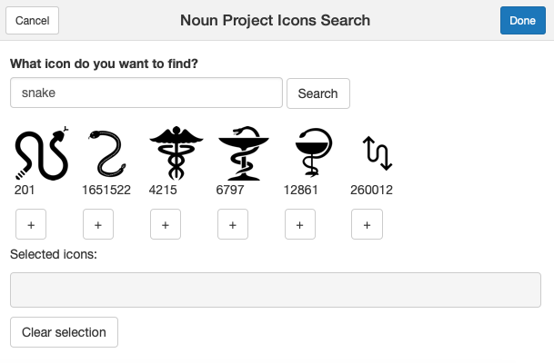

# nounprojectR

R package to use the [Noun Project](https://thenounproject.com/) API

[](https://travis-ci.org/CaRdiffR/nounprojectR)

### Installation

```r
devtools::install_github("CaRdiffR/nounprojectR")
```

### Basic usage

To use this package you need to [register with the Noun Project](https://thenounproject.com) and [create an app to get your own key and secret](https://thenounproject.com/developers/apps/). 
Copy and paste appname, key and secret and replace in this script:

```r
np_credentials(your_appname, your_key, your_secret)
# This function puts the NounProject details into your enviroment variables.
# Equivalent of that would be to set up and export values for the following variables:
# NOUNS_API_APPNAME, NOUNS_API_KEY, NOUNS_API_SECRET
```

To display a single icon that you know the index of, use the `display_icon` function.

```r
display_icon("1322")
```

That will open the RStudio Viewer and present you icon number `1322`.

To display many icons based on your query, use `display_many_icons`:

```r
display_many_icons("car") # by default there are 4 icons displayed in loop

display_many_icons("car", 6) # displays 6 first icons from the nounproject database
```

### RStudio addin

Instead of visiting the [Noun Project website](https://thenounproject.com/) all the time, you can use this RStudio addin which will help you to find the icon you are particulalry interested in. By default addin displays 20 most relevant searches for icons with public domain license only.

TO run it, simply go to `Addins > Noun Project` in your RStudio.



### Advanced options

For more advanced usecases, have a look at some examples below. 
```r
# this should download and show the icon of a plane
res <- get_nouns_api("icon/609") 
get_png(res)

# this should download and show the icon of four dogs
# make the url
url <- nounprojectR::make_term_endpoint("dog", num_of_imgs = 4)
# hit the Noun Project server 
res <- get_nouns_api(url)
# extract the JSON file
result <- httr::content(res)
# show the images
get_pngs_and_show(result)
```

### Issues and contributions
Please raise [issues](https://github.com/CaRdiffR/nounprojectR/issues) if you need help or would like to make comments.

We welcome new contributions! Please read our [Code of Conduct](https://github.com/CaRdiffR/nounprojectR/blob/master/CONDUCT.md) first.

### Note

This project was inspired by the Hacktoberfest 2018. Check out [Hacktoberfest GitHub blog](https://blog.github.com/2018-09-24-hacktoberfest-is-back-and-celebrating-its-fifth-year/) and support the event in the following editions.
